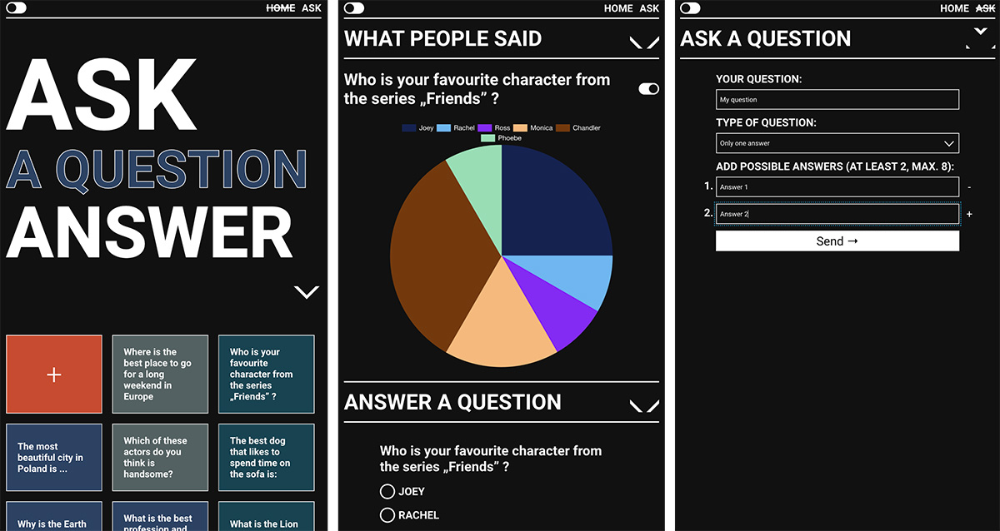

# AskPeopleApp - Frontend


## Demo

Working live demo: https://demoproject123.networkmanager.pl/

AI can answer many questions, but not those, realted to likes and judgments.
**AskPeopleApp** displays questions asked by users (on its main view). After clicking on a given question, you can see
how other users answered it (what are presented in the charts / slide with answers) and add your opinion / vote. You can
also create your own question for others to answer. There are three types of questions - open and closed (single and
multiple choice), in which you must also add possible answers.

## General info
This project is client side application that is used to conduct simple surveys among people and present their results in the form of charts / slides.

Backend repository - https://github.com/golasowska/AskPeopleAppBack

The main goal of the project was to practice creating full-stack applications using React, Node + Express using a MySQL database.

## Tech Stack

- typescript 4.9.5
- react 18.2.0
- react-router-dom 6.9.0
  ### Used libraries:
    - [swiper 9.1.1](https://swiperjs.com/react)
    - [react-chartjs-2 5.2.0](https://react-chartjs-2.js.org/)

## Run project

To develop this project clone repository and run commands:

```bash
  npm run i
```
```bash
  npm run start
```
Remember to run also backend repository to have working API.

## Related

[Backend](https://github.com/golasowska/AskPeopleAppBack)

## Author

- [@golasowska](https://github.com/golasowska)


